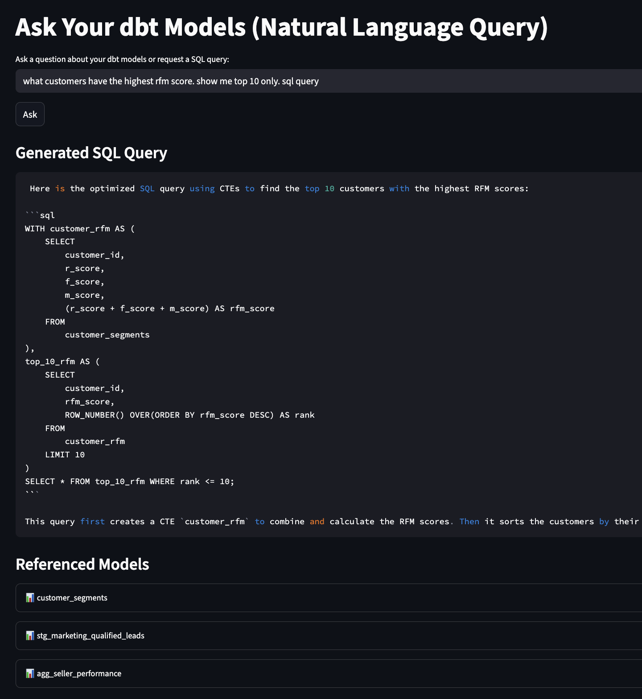

# Ask Your Data 🤖## 🚀 Key Features

- 🧠 **Natural Language Understanding**: Ask questions about your data models in plain English
- 📝 **Automatic SQL Generation**: Get ready-to-use SQL queries based on your questions
- 🔍 **Smart Documentation Search**: Find relevant model information instantly
- 💻 **100% Local Processing**: All AI processing runs on your machine using [Ollama](https://ollama.com/)
- 🔒 **Privacy First**: No data leaves your environment
- 📊 **Interactive Chat UI**: Clean, conversational interface for natural interaction
- 🎯 **Direct Query Execution**: Execute generated SQL queries with automatic result pagination
- 📥 **Export Results**: Download query results as CSV files
- 🔎 **Model Explorer**: Easily browse referenced models and their relationships
- 🐘 **Persistent PostgreSQL**: Direct connection to your data warehouse
- 🛠 **Flexible Setup**: Run locally or with Docker 🐳ligent data assistant that lets you interact with your data warehouse using natural language. Built on top of your `dbt` models, it allows you to:
- Ask questions about your data models in plain English
- Generate SQL queries automatically
- Explore data relationships and documentation
- All running locally on your machine!

## 🎯 What Problem Does This Solve?

Data analysts and engineers often need to:
1. Look up relationships between different data models
2. Write SQL queries based on complex data structures
3. Understand how data flows through various transformations
4. Share knowledge about data models with team members

This tool makes all of these tasks easier by providing a chat interface to your data documentation.

## 🚀 Key Features

- 🧠 **Natural Language Understanding**: Ask questions about your data models in plain English
- 📝 **Automatic SQL Generation**: Get ready-to-use SQL queries based on your questions
- 🔍 **Smart Documentation Search**: Find relevant model information instantly
- 💻 **100% Local Processing**: All AI processing runs on your machine using [Ollama](https://ollama.com/)
- � **Privacy First**: No data leaves your environment
- 📊 **Interactive UI**: Clean Streamlit interface for easy interaction
- 🐘 **Persistent PostgreSQL**: for your warehouse
- 🛠 **Flexible Setup**: Run locally or with Docker 🐳

---

## 🧠 How It Works

1. **Model Documentation**: Your dbt model YAML files contain valuable information about your data structure
2. **Vector Storage**: We convert this documentation into vector embeddings using Ollama
3. **Semantic Search**: When you ask a question, we find the most relevant model documentation
4. **LLM Processing**: A local LLM uses this context to answer your question or generate SQL
5. **Interactive UI**: Results are displayed in a user-friendly Streamlit interface

## 📁 Project Structure

```
ask-your-data/
├── src/
│   └── semantic_models/        # Core logic for embedding and querying
│       ├── embed_dbt_models.py # Processes dbt docs into vector store
│       └── query_models.py     # Handles semantic search and LLM interaction
│
├── streamlit_apps/            # UI Components
│   ├── app_nl_query.py       # Main query interface
│   └── README.md             # UI documentation
│
├── assets/
│   └── images/               # Screenshots and documentation images
│
├── dbt_ask_data/            # DBT project files
│   ├── dbt_project.yml      # DBT configuration
│   ├── models/              # Your data models
│   └── seeds/               # Reference data
│
├── docker-compose.yml       # Container setup (optional)
├── requirements.txt         # Python dependencies
└── README.md               # Project documentation
```

---

## ⚙️ Prerequisites

1. **Python 3.8+**: Required for running the application
2. **[Ollama](https://ollama.com/)**: Powers the AI features locally
   - Install from: https://ollama.com/download
   - Required models:
     ```bash
     ollama pull mistral      # For text generation
     ollama pull nomic-embed-text  # For embeddings
     ```
3. **Docker** (Optional): For running PostgreSQL if you don't have it installed locally

## 🚀 Quick Start

### 1. Clone & Setup

```bash
# Clone the repository
git clone https://github.com/sachinthomas91/ask-your-data.git
cd ask-your-data

# Create and activate virtual environment
python -m venv .venv
source .venv/bin/activate  # On Windows: .venv\Scripts\activate

# Install dependencies
pip install -r requirements.txt
```

### 2. Prepare Your Data

1. **Environment Setup**:
   - Create a `.env` file in the project root with your database credentials:
     ```env
     POSTGRES_DB=your_database
     POSTGRES_USER=your_user
     POSTGRES_PASSWORD=your_password
     POSTGRES_HOST=localhost
     POSTGRES_PORT=5432
     ```

2. **Configure dbt**:
   - Update `dbt_ask_data/profiles.yml` with your database credentials
   - Add your models in `dbt_ask_data/models/`
   - Make sure your models have YAML documentation

2. **Run dbt**:
   ```bash
   cd dbt_ask_data
   dbt debug    # Verify connection
   dbt run      # Build your models
   ```

### 3. Start the Application

1. **Create Vector Store**:
   ```bash
   # Process dbt documentation into vector store
   python src/semantic_models/embed_dbt_models.py
   ```

2. **Launch the UI**:
   ```bash
   # Start the Streamlit interface
   streamlit run streamlit_apps/app_nl_query.py
   ```

3. **Start Querying!**
   - Open http://localhost:8501 in your browser
   - Type your questions in natural language
   - Get instant answers or SQL queries

---

## �️ Example Usage

Here are some things you can ask:

1. **Natural Language Questions**:
   - "Which models have a foreign key to customers?"
   - "What information is available in the orders table?"
   - "How is customer lifetime value calculated?"

2. **SQL Generation**:
   - "Write a query to find top customers by order value"
   - "Show me how to join orders with customers"
   - "Generate SQL to calculate monthly revenue"



## 🛠️ Advanced Configuration

### Customizing the LLM

You can change the AI models in `streamlit_apps/app.py`:
```python
OLLAMA_EMBED_MODEL = "nomic-embed-text"     # For embeddings
OLLAMA_CHAT_MODEL = "qwen2.5-coder:7b"      # For SQL and text generation
```

Recommended models:
- For SQL generation: `qwen2.5-coder:7b`, `codellama:13b`
- For general queries: `mistral`, `qwen2:7b`

Available models can be found on [Ollama's model library](https://ollama.ai/library).

### Using the Chat Interface

1. **Natural Language Queries**:
   - Ask questions about your data models in plain English
   - The system will automatically detect if you need SQL or an explanation

2. **SQL Generation & Execution**:
   - For SQL queries, you'll see the generated SQL with explanatory comments
   - Click "Execute Query" to run the query
   - Results are automatically paginated (20 rows by default)
   - Download results as CSV files

3. **Model Exploration**:
   - Referenced models are shown in expandable sections
   - View model relationships and documentation
   - Explore raw context for debugging

### Performance Tips

1. **Vector Search**:
   - Adjust `n_results` in `get_relevant_context()` for more/less context
   - Default is 3 most relevant models

2. **Response Quality**:
   - Ensure detailed YAML documentation in your dbt models
   - Include column descriptions and relationships
   - Add business context in model descriptions

## 🤝 Contributing

Contributions are welcome! Please:

1. Fork the repository
2. Create a feature branch
3. Commit your changes
4. Push to the branch
5. Create a Pull Request

## 📝 License

This project is licensed under the MIT License - see the LICENSE file for details.

## 🙏 Acknowledgments

- [dbt](https://www.getdbt.com/) for the amazing data transformation framework
- [Ollama](https://ollama.com/) for making local AI accessible
- [Streamlit](https://streamlit.io/) for the intuitive UI framework
- [ChromaDB](https://www.trychroma.com/) for vector storage

---